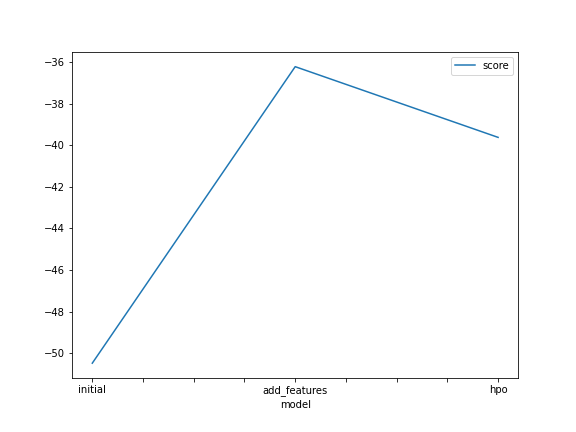
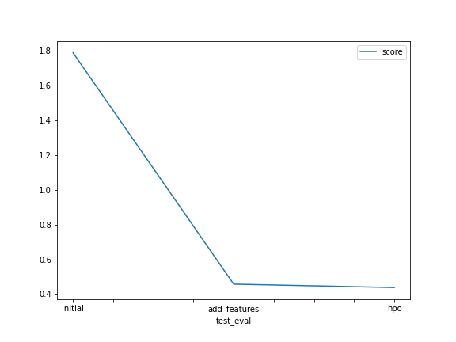

# Report: Predict Bike Sharing Demand with AutoGluon Solution
#### Mohamed Hekal

## Initial Training
### What did you realize when you tried to submit your predictions? What changes were needed to the output of the predictor to submit your results?
- The result must be zero or higher and I round the result to be an integer.

### What was the top ranked model that performed?
- WeightedEnsemble_L3 in the model that i tune it's hyperparameters.
## Exploratory data analysis and feature creation
### What did the exploratory analysis find and how did you add additional features?
- Extract hours, days, months, and years from the DateTime feature. 
- Convert some features to be categorical.  
- With a correlation graph, I eliminate the features that depend on each other and leave one feature. 
### How much better did your model preform after adding additional features and why do you think that is?
- After extracting the new features from date time and converting the others to categorical, the model's score improved by about 28%, and I think this happened because the new features contain more details about date time than before, and by converting to categorical data the model treats it as just numbers, and not on is the number big or small and the numbers do not play a role on weights.
## Hyper parameter tuning
### How much better did your model preform after trying different hyper parameters?
- In the kaggle score a slight difference was found after tuning the hyperparameters.
### If you were given more time with this dataset, where do you think you would spend more time?
- More time in feature engineering convert other numeric feature to categorical ones and see how this affect the model. Increase time_limit in Autogluon to train more models and of course more in trying different tuning on hyperparameters.
### Create a table with the models you ran, the hyperparameters modified, and the kaggle score.

# The 3 hyperparameters we tuned with the kaggle score as the result
- hpo stands for hyperparameters optimization.
|model|hpo1|hpo2|hpo3|score|
|--|--|--|--|--|
|initial|default|default|default|1.78881|
|add_features|default|default|default|0.45706|
|hpo|GBM (num_boost_round,num_leaves)|NN_TORCH (num_epochs,activation)|searcher,num_trials,scheduler|0.43748|

### Create a line plot showing the top model score for the three (or more) training runs during the project.

### Create a line plot showing the top kaggle score for the three (or more) prediction submissions during the project.

## Summary
In this project, I go throw on Ml life cycle from problem to build and test the models to help bike rental company to predict the bike demond.

- Product
    - Problem Phase : Making the most of the current data extracted from the systems in the bike rental companies for business growth.
    - Objectives Phase : Predict the number of bike trips to provide the bikes needed to increase company profitability and increase customer satisfaction
- Data
    - Obtain The Data : From the Kaggle website, I obtain the data and you can download it from [here](https://www.kaggle.com/competitions/bike-sharing-demand/data)
    - process : manipulate the data makeing some feature enginerring using pandas
    - Analyse : By using visual libraries and pandas to describe data.
- Engineering
    - Build model : Using the auto machine learning library (Auto Gluon) I build models for this project to predict the rental bikes demand.
    - test model : The model was tested on test data and gained scores from the Kaggle competition.